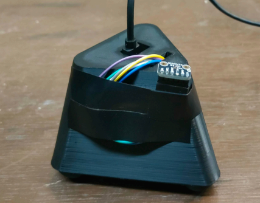
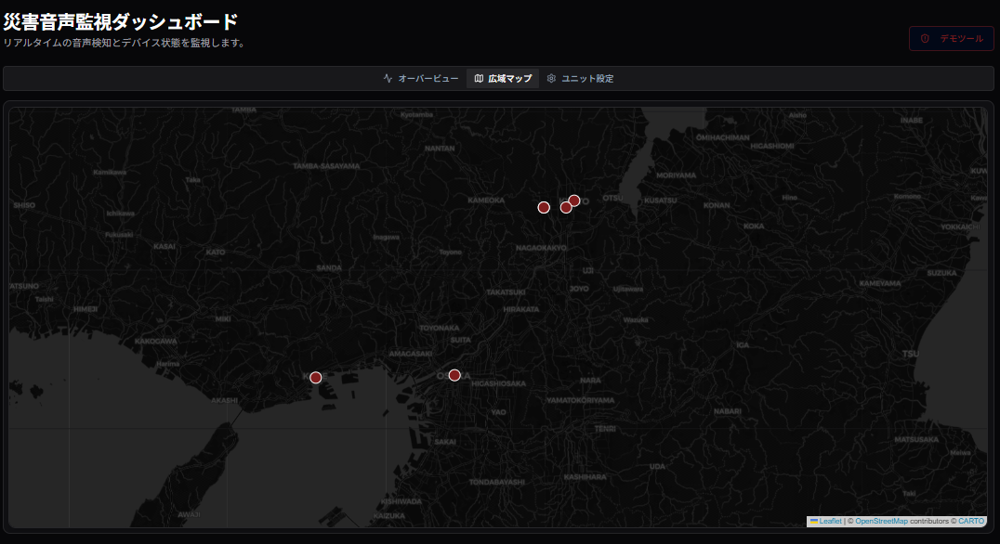
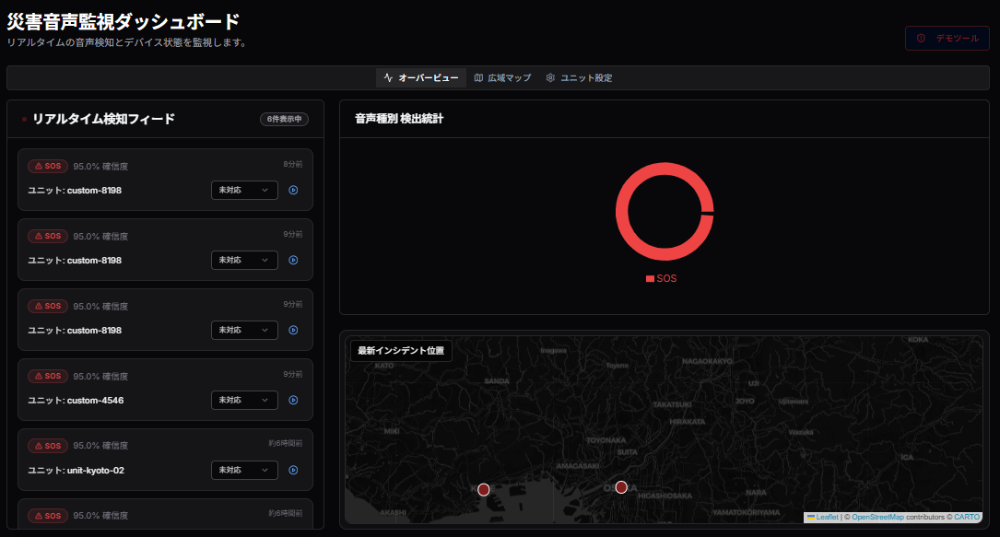
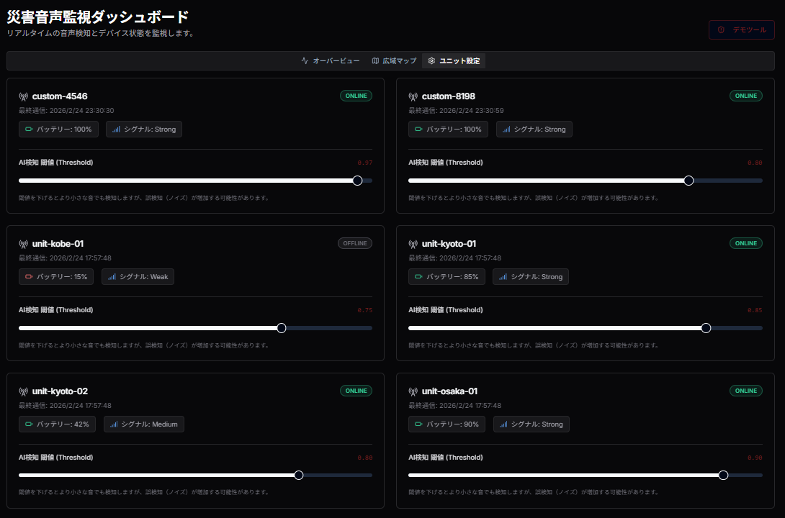
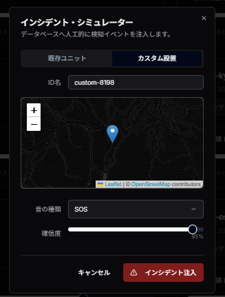
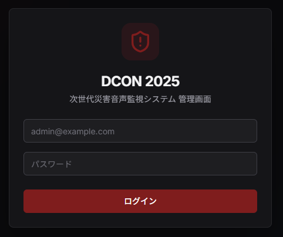

# Disaster Sound Manager (災害時音響監視システム)

## 概要
災害発生時や危険区域における「異常音」をリアルタイムで検知・可視化し、迅速な状況把握を支援するダッシュボードアプリです。
主に自治体の防災担当者や、現場の安全管理者を想定しています。

### 開発の背景・経緯：DCONへの挑戦
本プロジェクトは、**DCON（全国高等専門学校ディープラーニングコンテスト）**への出展を軸に、技術の社会実装を目指して開発されました。

災害現場において、映像だけでは把握しきれない「崩落音」「叫び声」「浸水音」などの音情報は、二次災害の防止や迅速な救助に不可欠なピースです。しかし、既存の監視システムは視覚情報が主であり、音響データの活用は進んでいません。本アプリは、エッジAIによる音響解析とクラウド連携を組み合わせることで、**「音で命を守るインフラ」**を実現するために開発しました。下の写真は音を取るユニットです。

## 公開URL
[https://disaster-sound-manager.vercel.app/](https://disaster-sound-manager.vercel.app/)

## 特徴と機能の説明

### 1. リアルタイム・サウンドマッピング
地図上に配置された監視ユニットから、音圧レベル（dB）をリアルタイムで取得。異常な音圧や特定の音（叫び声等）を検知すると、地図上のマーカーがアニメーションし、管理者に即座に視覚的アラートを通知します。

### 2. 音響イベントのタイムライン（Event Feed）
検知された音の種類（叫び声、崩落音、サイレン等）を時系列でフィード表示します。「どこで、いつ、何が起きたか」をテキストとマップの両面から即座に把握可能です。

### 3. デバイスのリモート設定管理
ダッシュボードから各ユニットの名称、設置場所、感度（しきい値）を直接変更できます。Supabaseの実装により、変更内容は瞬時に全管理画面へ同期されます。

### 4. シミュレーション機能 (Demo Panel)
DCONでのデモンストレーションや運用訓練を想定し、仮想の音響イベントを発生させる機能を搭載。特定の場所で火災や事故が発生した状況を擬似的に作り出し、システムの挙動を確認できます。

## 使い方

1. **ログイン**: 管理者アカウントでログインします（Next.js Middlewareにより認証保護されています）。
   

   *※現在はデモ用のため、一部機能を制限して公開しています。*

2. **状況監視**: ダッシュボードの地図（Map）とタイムライン（Feed）で、稼働中の全ユニットの状態を確認します。
3. **詳細分析**: 地図上のユニットをクリック、またはリストから選択して詳細チャートを表示。過去から現在までの音圧推移を確認します。
4. **ユニット設定**: 「設定（Settings）」タブから、設置環境に合わせて各ユニットの検知しきい値を調整します。
5. **デモ操作**: 画面端のデモパネルを使用して「Sound Event」を送信し、リアルタイムで通知・マッピングが更新される様子を確認します。

## 使用技術 (技術スタック)

### 言語・フレームワーク
* **TypeScript**: 全編採用による堅牢な型安全性の確保
* **Next.js (App Router)**: 高速なレンダリングと効率的なルーティング
* **Tailwind CSS / shadcn/ui**: モダンで統一感のある管理画面UI

### 主要ライブラリ
* **Supabase (Realtime / Database / Auth)**: データの永続化およびリアルタイム双方向通信
* **Leaflet / React Leaflet**: 高度な地図描画とマーカー制御
* **Recharts**: 音圧データの動的な可視化グラフ
* **Lucide React**: 直感的なアイコンシステム

### 開発ツール・インフラ
* **VSCode**: メインエディタ
* **Vercel**: 自動CI/CDおよびホスティング

## 開発期間・体制
* **開発体制**: 個人開発
* **開発期間**: 2026.01.15 ~ 2026.02.24 (約400時間)

## 工夫した点・苦労した点
* **リアルタイム性の追求**: SupabaseのRealtime機能をフル活用し、DBの更新が即座にUIへ反映される「ノーリロード」な体験を実現しました。
* **直感的なUI/UX**: 災害現場という緊迫した状況を想定し、重要なアラートが埋もれないよう、地図・チャート・フィードの配置をミリ単位で調整しました。
* **データ構造の設計**: `units`テーブルと`sound_events`テーブルをリレーションさせ、デバイスの状態と発生事象を効率的に管理できるようSQLレベルで最適化しました。

## 既知の課題と今後の展望
* **実機との通信**: 実機から通信で送られてきたものを表示できるようにする予定です。
* **AIによる音響解析の高度化**: 現段階ではシミュレーションが主ですが、実際の環境音を学習させたエッジAIモデルとのAPI連携を深化させます。
* **プッシュ通知・音声合成**: ブラウザを閉じていても異常を通知する機能や、音声合成による状況読み上げ機能の実装。
* **モバイル対応の強化**: 現場の救助隊員が手元で確認できるよう、モバイル特化型のUIモードを開発予定。